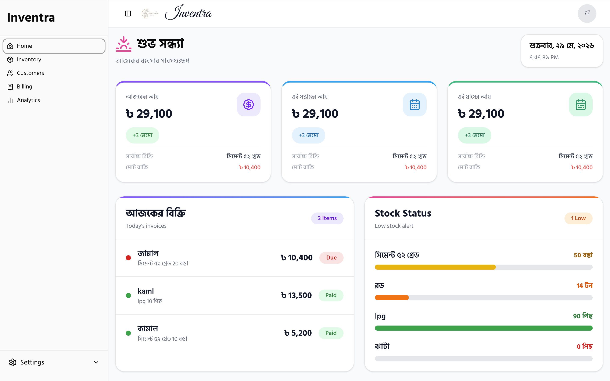
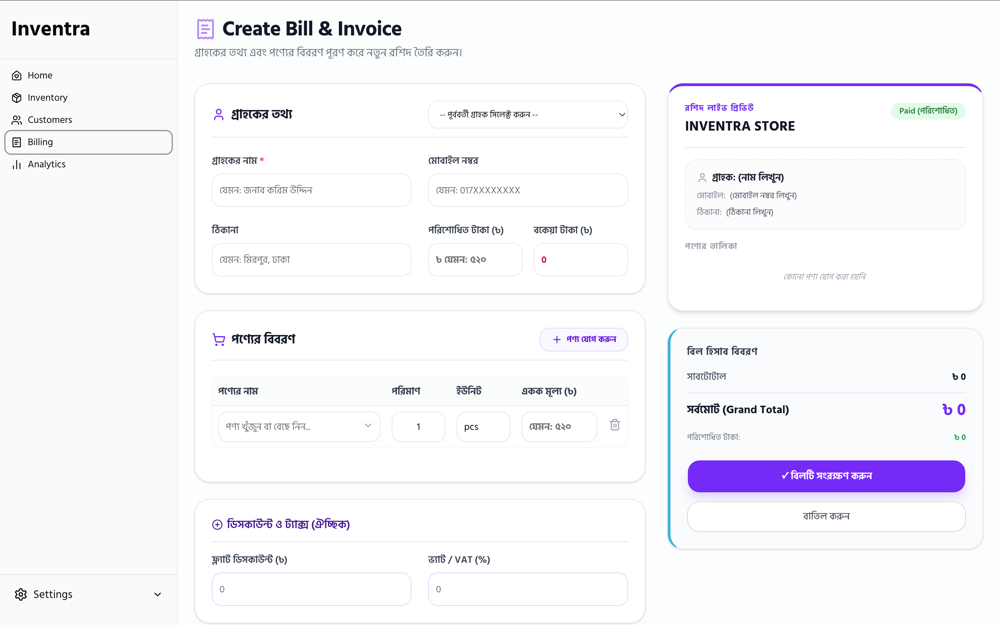
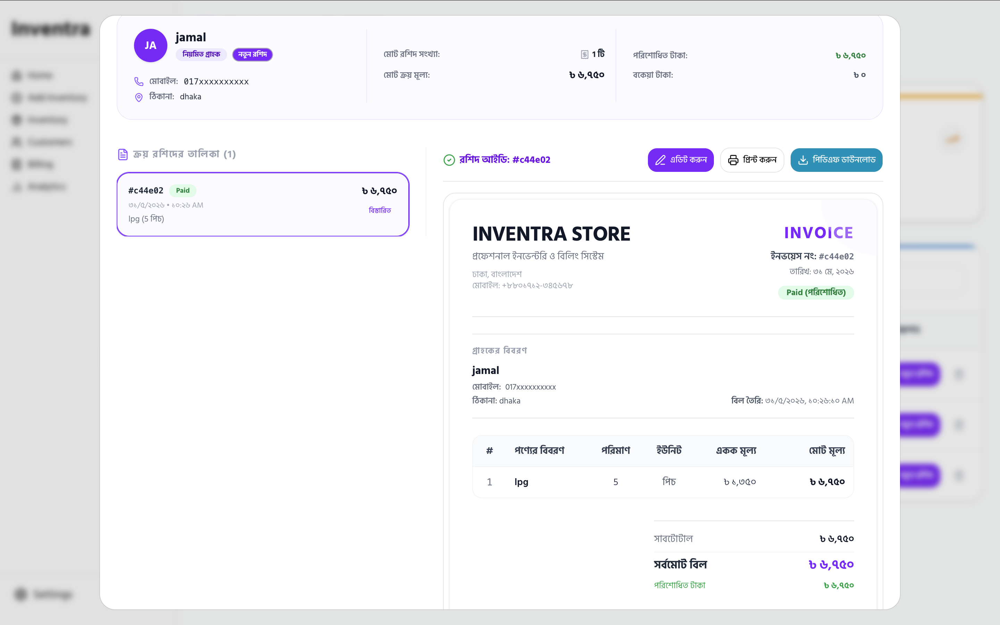

# 🚀 Inventra — Smart Inventory & Billing Management System


Inventra is a modern full-stack inventory and billing management system built to simplify stock management, customer handling, invoice generation, and business analytics in one clean dashboard.

Designed with performance, scalability, and beautiful UI in mind, Inventra helps businesses manage products, billing, customers, and inventory operations efficiently.

---

# ✨ Features

## 📦 Inventory Management

* Add new products
* Update stock instantly
* Edit product information
* Delete products securely
* Low stock warnings
* Unit-based stock system

---

## 🧾 Billing System

* Create professional invoices
* Customer-based billing
* Automatic total calculations
* Paid & Due tracking
* Billing history support
* Smart invoice preview

---

## 👥 Customer Management

* Customer profiles
* Purchase history
* Due amount tracking
* Search customers instantly
* Customer analytics

---

## 📊 Dashboard Analytics

* Total sales overview
* Revenue tracking
* Low stock monitoring
* Customer statistics
* Business performance insights

---

## 🔐 Authentication & Authorization

* Secure Google Authentication
* JWT-based protected APIs
* Admin-only inventory controls
* Role-based UI rendering

---

# 🛠️ Tech Stack

## Frontend

* **Next.js 16**
* **React 19**
* **Tailwind CSS**
* **Shadcn UI**
* **Lucide React Icons**
* **Sonner Toast**
* **Framer Motion**

---

## Backend

* **Node.js**
* **Express.js**
* **MongoDB Atlas**
* **JWT Authentication**
* **Better Auth**
* **JOSE JWT Verification**

---

## Database

* **MongoDB**
* Collections:

  * users
  * inventory
  * billing
  * sessions

---

# 🎨 UI & Design

* Fully Responsive Design
* Premium Dashboard Layout
* Modern Glassmorphism Inspired Cards
* Gradient UI Elements
* Smooth Hover Animations
* Mobile Optimized Experience

---

# 📁 Project Structure

```bash
inventra/
│
├── public/
│   └── images/
│       ├── 1.png
│       ├── 2.png
│       ├── 3.png
│       └── logo.png
│
├── src/
│   ├── app/
│   ├── components/
│   ├── lib/
│   ├── hooks/
│   ├── utils/
│   └── services/
│
├── server/
├── package.json
└── README.md
```

---

# 📸 Project Screenshots

## Dashboard



---

## Inventory Management



---

## Billing & Customers



---

# ⚡ Installation

## Clone the project

```bash
git clone YOUR_REPOSITORY_URL
```

---

## Install dependencies

```bash
npm install
```

---

## Setup Environment Variables

Create a `.env.local` file and add:

```env
NEXT_PUBLIC_SERVER_URL=
MONGODB_URI=
GOOGLE_CLIENT_ID=
GOOGLE_CLIENT_SECRET=
BETTER_AUTH_SECRET=
```

---

## Run Development Server

```bash
npm run dev
```

---

# 🌐 Live Demo

🔗 https://inventra-sandy.vercel.app/

---

# 🔒 Admin Features

Only Admin Users Can:

* Add inventory
* Edit inventory
* Delete products
* Access protected routes

---

# 📈 Future Improvements

* PDF Invoice Download
* Barcode Scanner Support
* Multi-user Roles
* Sales Reports Export
* Dark Mode
* Email Invoice System

---

# 👨‍💻 Developer

Built with passion using modern web technologies and clean UI principles.

---

# ⭐ Support

If you like this project, consider giving it a star ⭐

---
